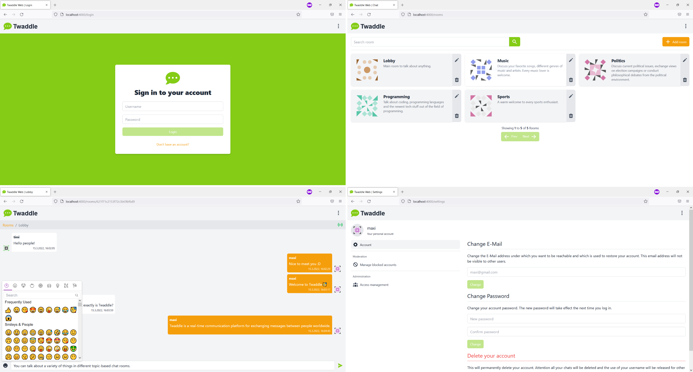

# Twaddle Web

> UI of the Twaddle real time messenger and communication platform.

## Table of Contents

- [Introduction](#introduction)
- [Architecture](#architecture)
- [Deployment](#deployment)
  - [Build configuration](#build-configuration)
  - [Standalone operation](#standalone-operation)
  - [Cloud operation](#cloud-operation)
- [License](#license)
  - [Forbidden](#forbidden)

## Introduction

This is the UI of the Twaddle messenger, a messenger with user management
for mutual communication exchange in real time. This project does not serve
to replace existing messengers from production, but rather to understand
communication processes in the area of messaging. However, the application offers
a fully browser-based interface based on a Single Page Application (SPA).



In addition to the classic features for users, the interface also supports numerous
administrative features and those used to moderate the chats.

## Architecture

Architecturally, it is a JavaScript-based browser application. The application runs
on a single page application basis and is therefore highly reactive. To be clear,
this is a monolithic architecture and therefore not a micro front end. Both HTTP-based
communication and WebSocket-based communication are used to communicate with the backend.

## Deployment

A productive version of the application must be created. Basically, these are just static
web files, such as HTML, CSS and JavaScript assets, which need a web server to deploy.
In principle, any HTTP web server is suitable for this.

When building the application, it should be noted that the application must first be
configured with environment variables so that configurations such as the backend URL are
set via environment variables. See [Build configuration](#build-configuration) for details.

### Build configuration

Certain operations of the application need to be configured, such as the address of the
backend endpoints. Environment variables are used for this. It is important to note that
environment variables are fixed at build time and cannot be changed at runtime. Therefore,
the environment variables must already be available at construction time.

The configuration takes place exclusively via environment files. See the
[CRA](https://create-react-app.dev/docs/adding-custom-environment-variables/) build tool
documentation for details.

The following variables are used by the application.

| Variable                   | Description                                                                                          | Required |
| -------------------------- | ---------------------------------------------------------------------------------------------------- | -------- |
| REACT_APP_TWADDLE_REST_URI | Sets the endpoint of the Twaddle RESTful API, this includes possible prefixes and version numbers    | true     |
| REACT_APP_TWADDLE_WS_URI   | Sets the endpoint of the Twaddle Web Socket API, this includes possible prefixes and version numbers | true     |

### Standalone operation

In standalone mode, the deployment does not take place in the form of a container in the
cloud but manually on a web server.

First, the dependencies that are necessary for the build must be loaded. This includes build
tools and libraries. A [Node.js](https://nodejs.org/en/) environment is also required for
the construction period.

```sh
$ npm run install
```

It should be noted that the dependencies are only required at the construction time but not at
runtime. The generated build contains everything necessary and needs nothing more. A productive
version can be created with the following command.

```sh
$ npm run build
```

At this point, a web server is required, with the help of which the interface can be provided.
To do this, the content of the generated `build` directory must be transferred to the web server.

### Cloud operation

In the cloud version, neither a Node.js version nor a web server installation is required.
The application is deployed with the help of NGINX in the form of a container. To do this, the
image must first be built.

```sh
$ docker build -t twaddle/web:latest .
```

A container can then be started based on the image. The placeholder port must of course be
replaced with a valid port.

```sh
$ docker run -p <PORT>:80/tcp --name twaddle-web twaddle/web:latest
```

## License

Copyright (c) 2022 0x1C1B

Permission is hereby granted, free of charge, to any person obtaining a copy
of this software and associated documentation files (the "Software"), to deal
in the Software without restriction, including without limitation the rights
to use, copy, modify, merge, publish, distribute, sublicense, and/or sell
copies of the Software, and to permit persons to whom the Software is
furnished to do so, subject to the following conditions:

The above copyright notice and this permission notice shall be included in all
copies or substantial portions of the Software.

THE SOFTWARE IS PROVIDED "AS IS", WITHOUT WARRANTY OF ANY KIND, EXPRESS OR
IMPLIED, INCLUDING BUT NOT LIMITED TO THE WARRANTIES OF MERCHANTABILITY,
FITNESS FOR A PARTICULAR PURPOSE AND NONINFRINGEMENT. IN NO EVENT SHALL THE
AUTHORS OR COPYRIGHT HOLDERS BE LIABLE FOR ANY CLAIM, DAMAGES OR OTHER
LIABILITY, WHETHER IN AN ACTION OF CONTRACT, TORT OR OTHERWISE, ARISING FROM,
OUT OF OR IN CONNECTION WITH THE SOFTWARE OR THE USE OR OTHER DEALINGS IN THE
SOFTWARE.

[MIT License](https://opensource.org/licenses/MIT) or [LICENSE](LICENSE) for
more details.

### Forbidden

**Hold Liable**: Software is provided without warranty and the software
author/license owner cannot be held liable for damages.
